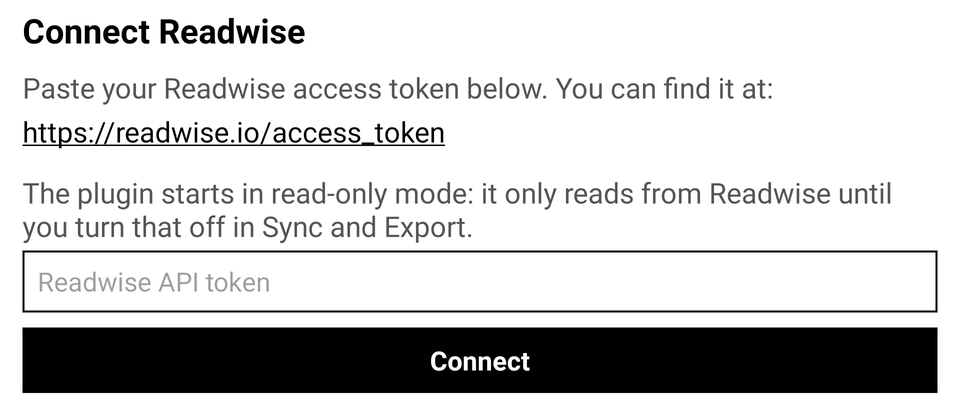
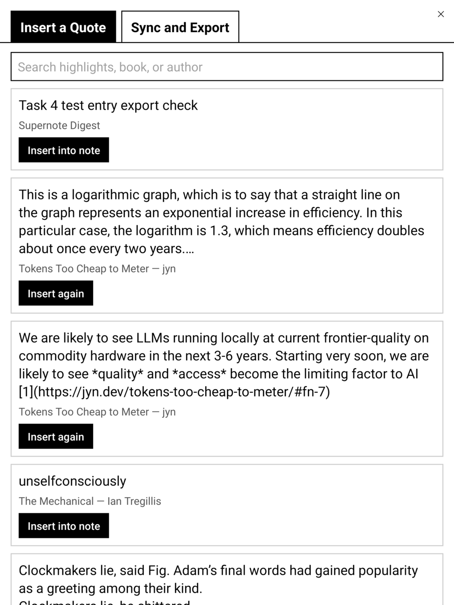
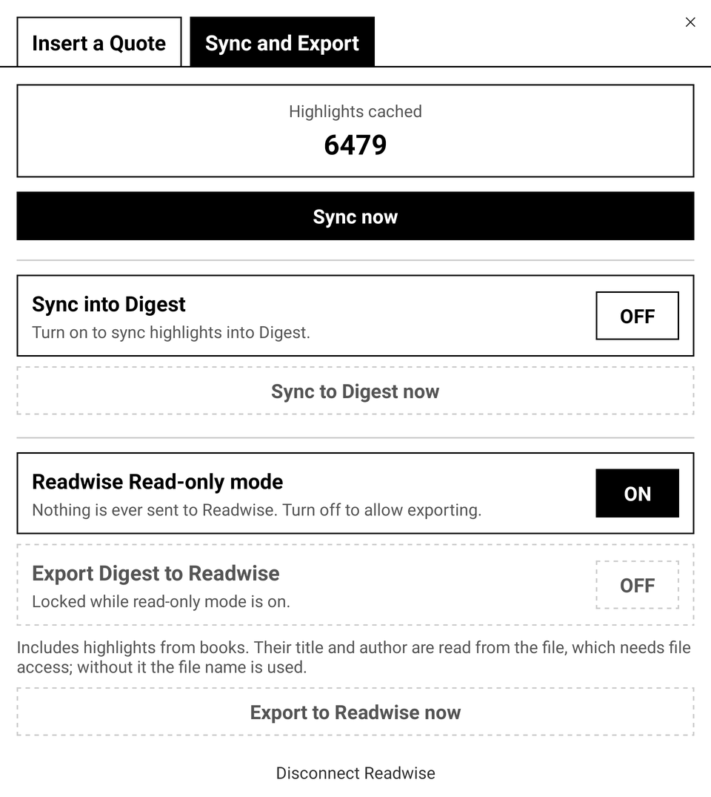
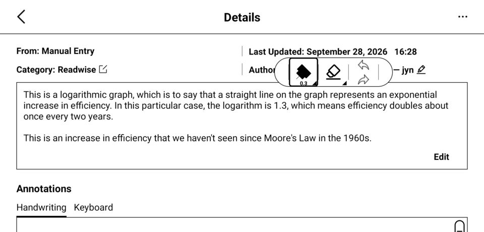
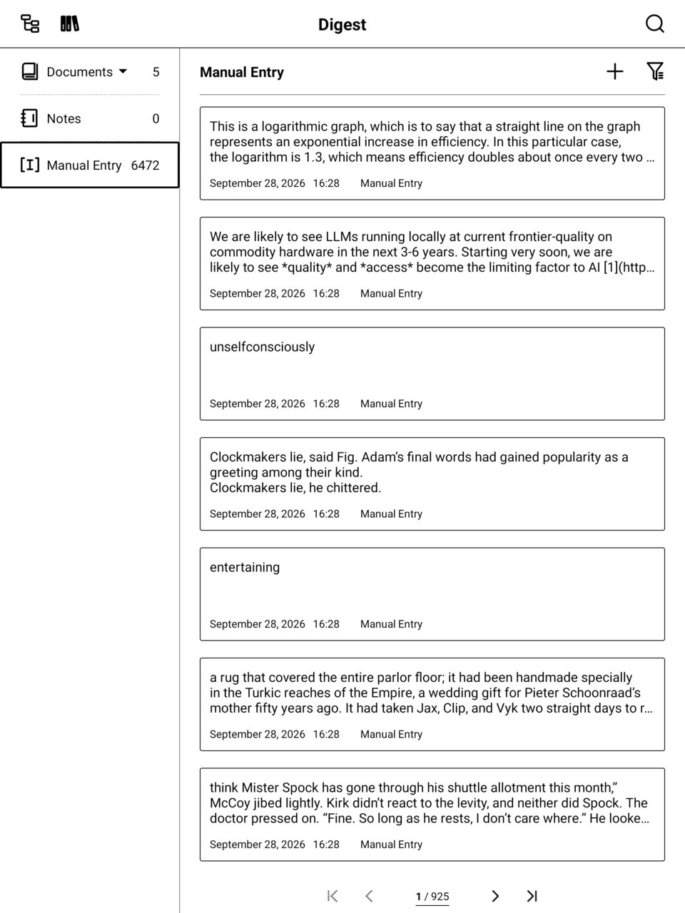

# readwise-supernote-digest

A Supernote plugin that syncs [Readwise](https://readwise.io) highlights to and from your
Supernote.

* cache your highlights on-device
* insert Readwise quotes into the note
* mirror Readwise quotes into Supernote's native Digest app

## Walk Through

### Connect your Readwise account and cache highlights on-device

Paste your [Readwise access token](https://readwise.io/access_token) once; the plugin validates
it, does a full export sync, and keeps a local SQLite cache so everything after that is instant
and works offline.



### Insert any highlight into the note you're writing

The plugin opens on the **Insert a Quote** tab. Search across all cached highlights by text,
book, or author, and insert one as a real textbox directly onto the current page.



The result is a normal textbox on the page — resizable/movable like anything else in a note.

### Sync and Export tab

Highlight count, manual "Sync now", and large tap-anywhere toggles (sized for the Nomad's e-ink display)
for the two Digest integrations below and for **Readwise Read-only mode**.

**Readwise Read-only mode is on by default**: the plugin only reads from Readwise, and nothing it does can change
your Readwise account. While it is on, the export controls are locked and say why. Turning it off asks
for confirmation. The rule is enforced in the Readwise client itself (not just by disabling buttons), so
no screen or future feature can write around it.



### Integrate with Supernote's Digest app

Highlights get synced into the actual on-device Digest app (Settings/NOTE sidebar → Digest),
not a lookalike — tagged with a `Readwise` category so they're easy to filter, alongside anything
you save to Digest yourself.





### Export your own Digest entries back to Readwise

Anything *you* save to Digest (not synced in from Readwise) can be exported back to your Readwise
library, with automatic loop-prevention so Readwise-sourced entries never get re-exported.

## Install

Download `readwise-digest-vX.Y.Z.snplg` from the
[latest release](https://github.com/philips/readwise-supernote-digest/releases/latest), copy it to
the `MyStyle` folder on your Supernote, and install it from Settings > Apps > Plugins (Add Plugin).
Installing a newer release over an older one upgrades it in place and keeps your settings and cached
highlights. Each release also has a `.sha256` file for the archive.

To build it yourself, see [Quick start](#quick-start). Maintainers: [`docs/RELEASING.md`](docs/RELEASING.md).

## How it works

- **Local cache**: `sn-plugin-lib` SQLite storage, keyed to the Readwise API's `export`/`highlights`
  endpoints (see [Readwise's API docs](https://readwise.io/api_deets)).
- **Insert into note**: a real `TYPE_TEXT` TextBox element via `PluginCommAPI`/`PluginFileAPI`.
- **Digest integration**: direct `ContentResolver` calls against Supernote's own
  `content://com.ratta.supernote.knowledge.provider` — undocumented by Supernote, reverse-engineered
  by decompiling the on-device APK. Full writeup: [`docs/KNOWLEDGE_PROVIDER.md`](docs/KNOWLEDGE_PROVIDER.md).

See [`plans/plan.md`](plans/plan.md) for the full task-by-task design/implementation history
(including three dead ends that turned out not to be dead ends after more digging), and
[`docs/DEVELOPMENT.md`](docs/DEVELOPMENT.md) for the dev/build/deploy workflow.

## Known gaps

Digest exports cover Manual Entries and highlights from **Documents** (PDF/EPUB), filed on Readwise
under the book's real title and author read from the file. Two limits: highlights in files the plugin
can't read (the Supernote cloud-sync folder, [#1](https://github.com/philips/readwise-supernote-digest/issues/1))
use the file name instead, and **Notes** highlights aren't exported yet. See "Open issues" in
[`plans/plan.md`](plans/plan.md).

## Device

Supernote Nomad at `100.103.149.40` (adb over Wi-Fi/Tailscale, port 5555).

## Quick start

```bash
adb connect 100.103.149.40:5555
scripts/snplg-deploy.sh              # build + install
scripts/snplg-hotreload.sh --build   # JS-only fast iteration
scripts/snplg-logs.sh                # tail plugin logs
```

See `docs/DEVELOPMENT.md` for the full environment setup (Android SDK, JDK, etc.) and dev loop.
